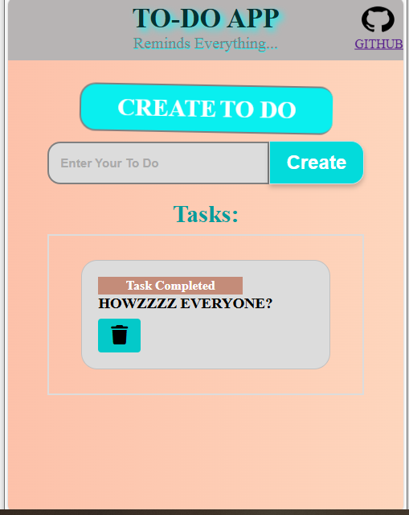
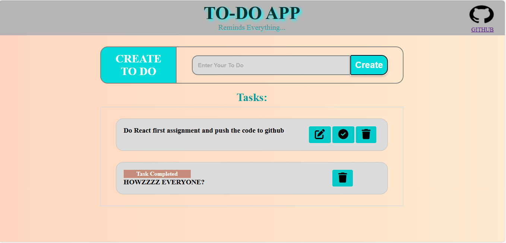

# To-Do Application
A simple yet functional To-Do application built with React.js and Vite. Designed to help users manage daily tasks with ease. The app allows users to create, update, mark as complete, and delete tasks — all in a clean, responsive interface.

## Features
- Add Tasks – Quickly add new tasks with a clean input interface.
- Edit Existing Tasks – Modify your to-dos directly without deleting or recreating them.
- Mark as Completed – Visually differentiate completed tasks to track your progress.
- Delete Tasks – Remove completed or unwanted tasks with one click.
- Clear & Intuitive UI – Focused design that puts your tasks front and center.
- Responsive Design – Works seamlessly on mobile, tablet, and desktop.

## Project Setup Instructions
### 1. Clone the repository
```bash
git clone 
cd To-do-using-react
```
### 2. Install Dependencies
```bash
npm install
```

## How to run locally
```bash
npm run dev
```
Then open http://localhost:5173 in your browser.

## Screenshots



## Github Link


